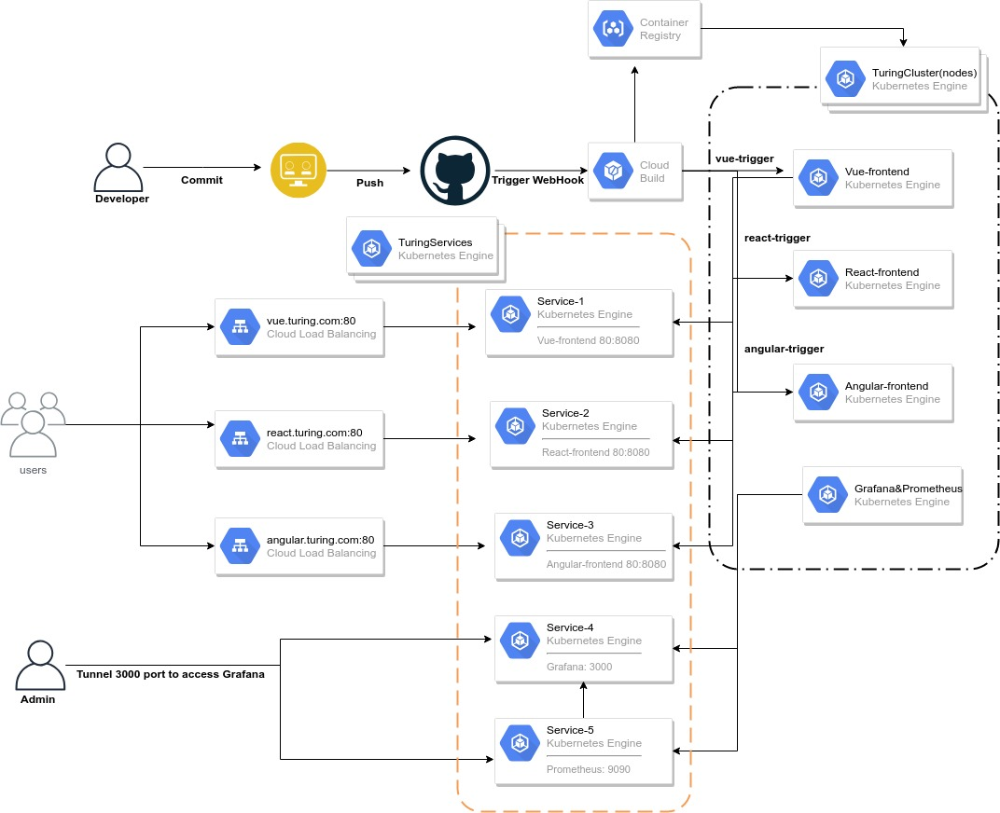
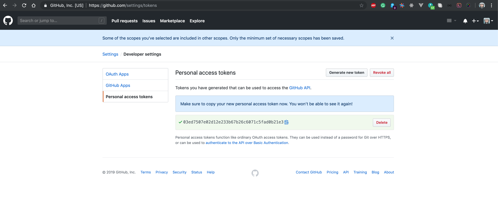

# TLDR; Turing DevOps Challenge - GitOps Kubernetes CD Pipelines

## Problem Statement
Build a complete automated deployments for multiple web apps residing in multiple repos into a single cluster with multiple nodes, each web app having a different URL so that public users can access the same. Adding Autoscaling to handle the unexpected load as that the cluster/system determines the load and scales up the web apps horizontally so that the system will be up and available irrespective of the unexpected load/traffic to the web apps.
A single monitoring tool to visualize and monitor the health and resource utilization of the cluster. 

## Techstack
* GCP - Google Cloud Platform to host our applications
* GKE- Google Kubernetes Engine (Managed Kubernetes by Google Cloud) for container orchestration (AWS EKS, Azure AKS or DigitalOcean Kubernetes also can be used)
* Cloud Build - Automated Build tool for all kinds of applications (Can be replaced with any other CI/CD tools like jenkins, circleci, azure pipelines or travis-ci etc.,)
* Docker - To package and containerize the applications
* Github - Source repositories and collaboration.
* Prometheus - To scrape the metric data and monitor Kubernetes
* Grafana - To visualize the data and monitor the health of resources using the metrics queried from prometheus.

## Architecture

## Auto Deployed Repositories
* [React](https://github.com/itsbalamurali/turing-react)
* [VueJS](https://github.com/itsbalamurali/turing-vue)
* [Angular](https://github.com/itsbalamurali/turing-angular)

## Load Testing

Load testing has been done using [Hey](https://github.com/rakyll/hey).

## Setup
    
### Github Setup

### Cloud Build Setup

### Kubernetes Deployments

*Deploy Prometheus & Grafana*

Step1: Create a namespace with name monitoring in the existing cluster .

`kubectl create -f monitoring-namespace.yaml`

Step2: Create a Cluster role and ConfigMap for prometheus configuration.

`kubectl create -f prometheus-clusterrole.yaml`

`kubectl create -f prometheus-config.yaml -n monitoring`

Step3: Create a single pod for prometheus deployment and service to expose prometheus.

`kubectl create -f prometheus-deployment.yaml --namespace=monitoring`

Step5: Deploy grafana by creating its deployment and service.

`kubectl create -f grafana.yaml`

Step6: Goto services section in kubernetes engine in GCP and open grafana service and click on port forwarding and execute the command in your local to expose and see the grafana dashboard
Kubernetes Engine---> Services---> grafana---> Ports---> Port forwarding---> copy the output command---> execute in your local dev machine.

Step7: After exposing the port from the above output command, open your browser of your choice and navigate to `http://localhost:8080` and do the following things to add kubernetes dashboard to check the resource utilization of the cluster
Click on the icon in the upper left of grafana and go to **“Data Sources”**.
Click **“Add data source”**.
For name, just use *“prometheus”*
Select *“Prometheus”* as the type. Now just enter `http://prometheus:9090` in the datasource host config. This means that grafana will lookup the prometheus service running in the same namespace on port 9090.
Create a New dashboard by clicking on the upper-left icon and select Import dashboard and type dashboard id 2115 (Predefined Kubernetes & Prometheus V2 Dashboard) and import the same! 

Step8: Now you can start visualizing and monitoring the kubernetes cluster metrics for all the applications

### Monitoring

**Prometheus Metrics**

**Grafana Visualizations**

# P.S
This setup can be improved and made simpler in the following ways which cloudn't be done due to time constraints.

* Setup KubernetesDNS.
* Setup Node Autoscaler for AutoScaling Kubernetes Nodes in the event of high load.
* Setup much cleaner simple cloudbuild.yaml files avoid repeated steps across repos.
* Setup builds for both git branches and release tags.
* Better log monitoring
* Setup Build & Deployment notifications to Slack, Email & Github Status etc.,
