# TLDR; Turing DevOps Challenge - GitOps Kubernetes CD Pipelines

## Problem Statement
Build a complete automated deployments for multiple web apps residing in multiple repos into a single cluster with multiple nodes, each web app having a different URL so that public users can access the same. Adding Autoscaling to handle the unexpected load as that the cluster/system determines the load and scales up the web apps horizontally so that the system will be up and available irrespective of the unexpected load/traffic to the web apps.
A single monitoring tool to visualize and monitor the health and resource utilization of the cluster. 

## Techstack
* GCP - Google Cloud Platform to host our applications
* GKE- Google Kubernetes Engine (Managed Kubernetes by Google Cloud) for container orchestration (AWS EKS, Azure AKS or DigitalOcean Kubernetes also can be used)
* Cloud Build - Automated Build tool for all kinds of applications (Can be replaced with any other CI/CD tools like jenkins, circleci, azure pipelines or travis-ci etc.,)
* Docker - To package and containerize the applications
* Github - Source repositories and collaboration.
* Prometheus - To scrape the metric data and monitor Kubernetes
* Grafana - To visualize the data and monitor the health of resources using the metrics queried from prometheus.

## Auto Deployed Repositories
* [React](https://github.com/itsbalamurali/turing-react)
* [VueJS](https://github.com/itsbalamurali/turing-vue)
* [Angular](https://github.com/itsbalamurali/turing-angular)

## Load Testing

Load testing has been done using [Hey](https://github.com/rakyll/hey).

## Setup
    
### Github Setup

### Cloud Build Setup

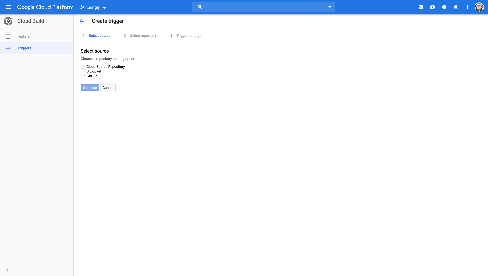
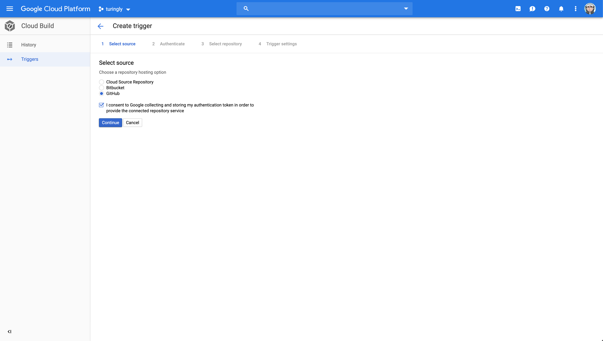
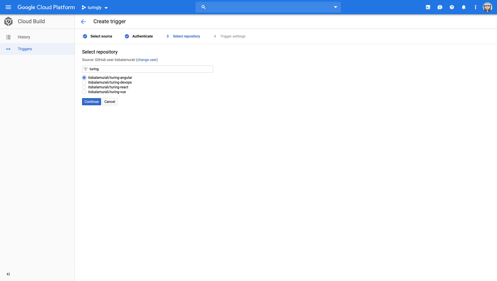
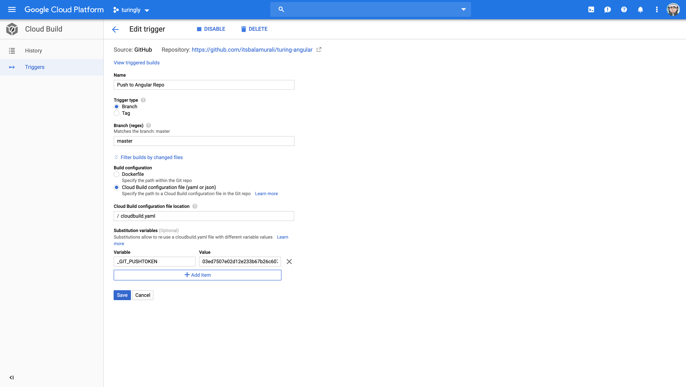
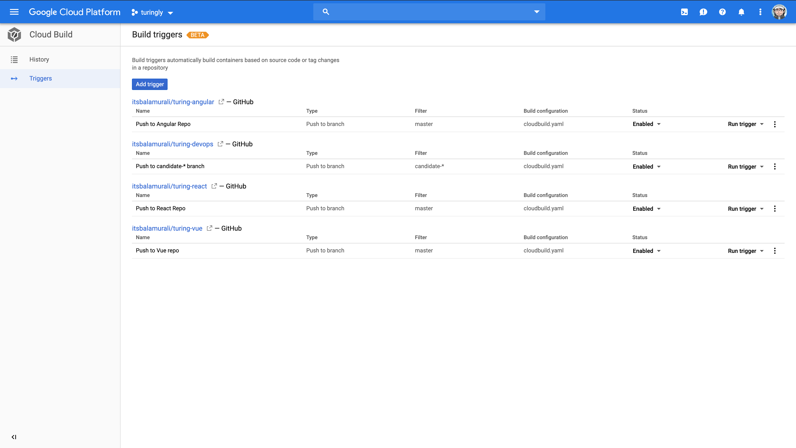
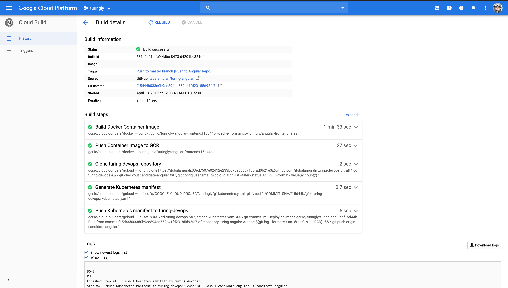
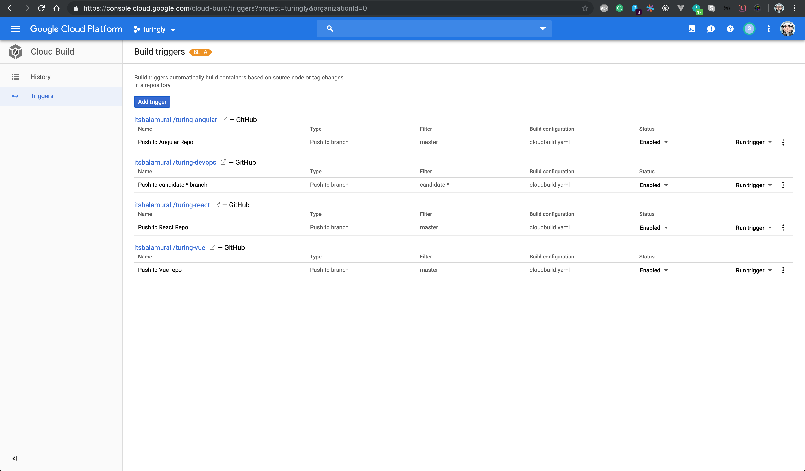

### Kubernetes Deployments

* Deploy Prometheus & Grafana

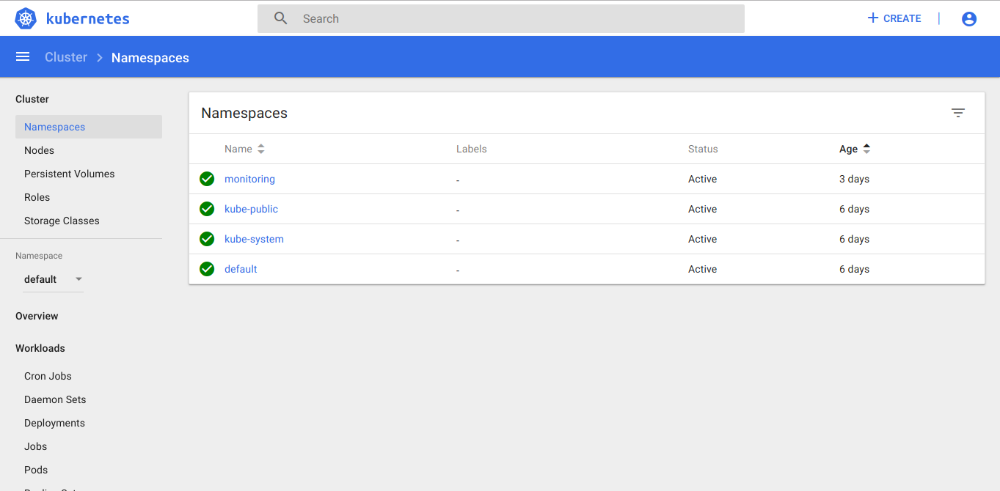
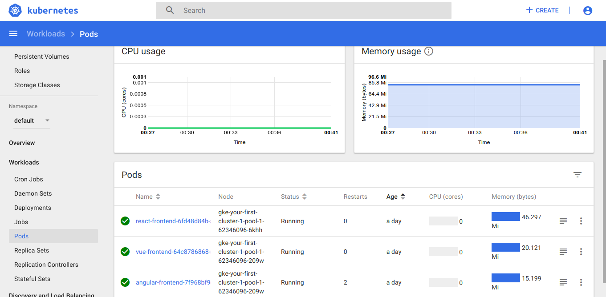
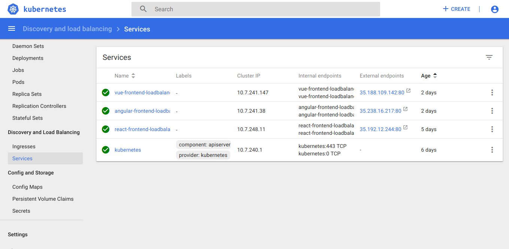
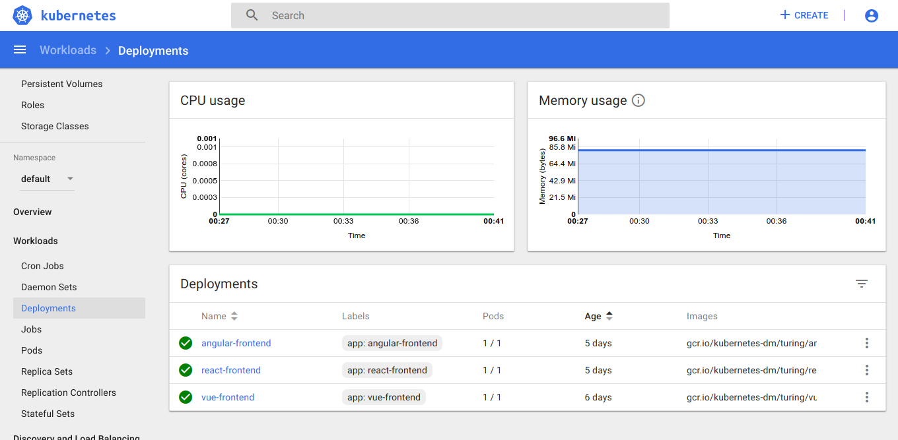
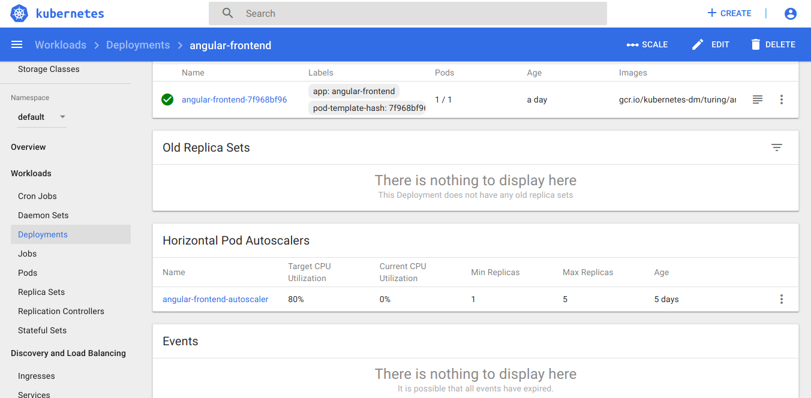

### Monitoring

**Prometheus Metrics**

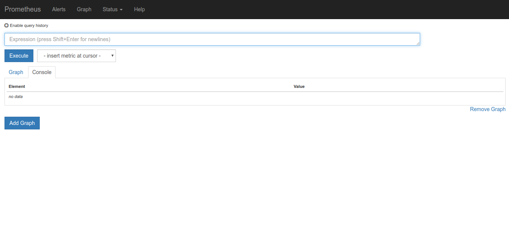
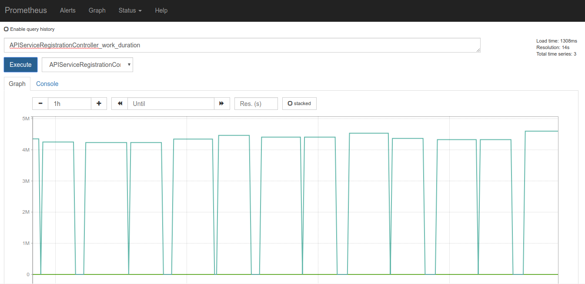
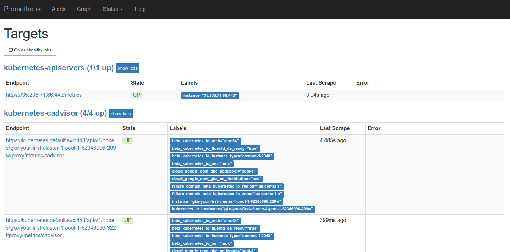

**Grafana Visualizations**

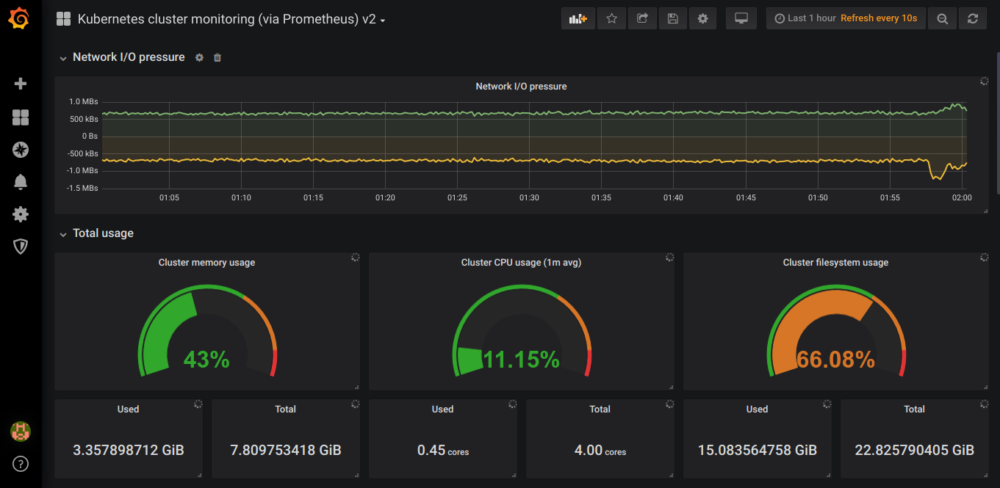
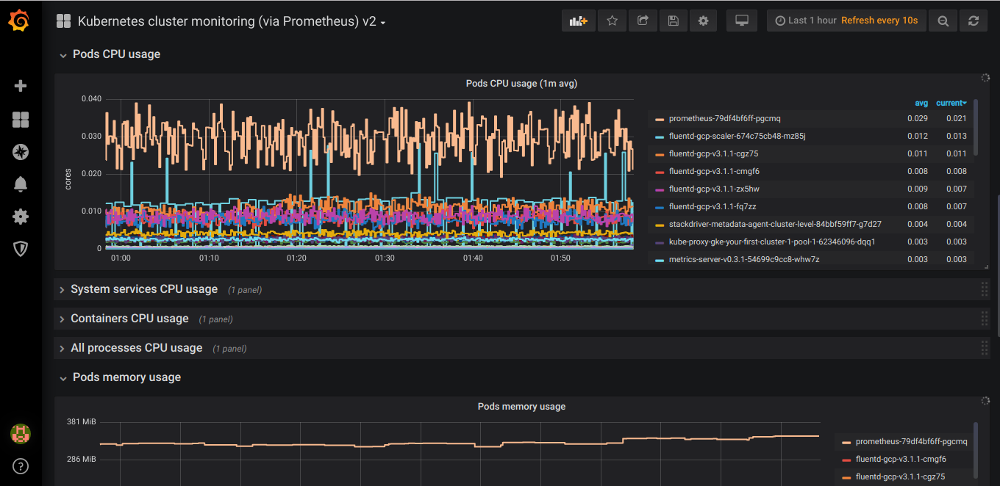
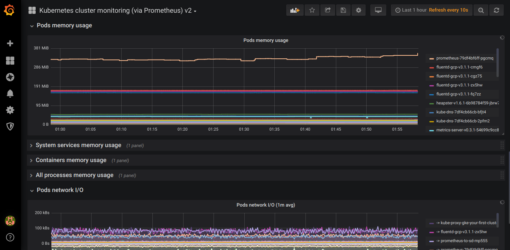

# P.S
This setup can be improved and made simpler in the following ways which cloudn't be done due to time constraints.

* Setup KubernetesDNS.
* Setup Node Autoscaler for AutoScaling Kubernetes Nodes in the event of high load.
* Setup much cleaner simple cloudbuild.yaml files avoid repeated steps across repos.
* Setup builds for both git branches and release tags.
* Better log monitoring
* Setup Build & Deployment notifications to Slack, Email & Github Status etc.,
